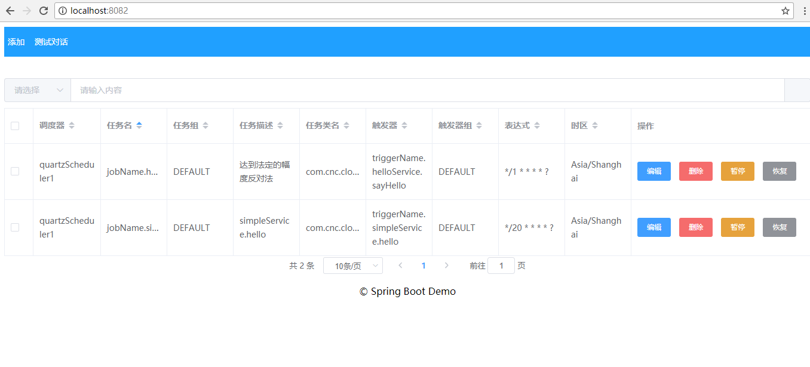
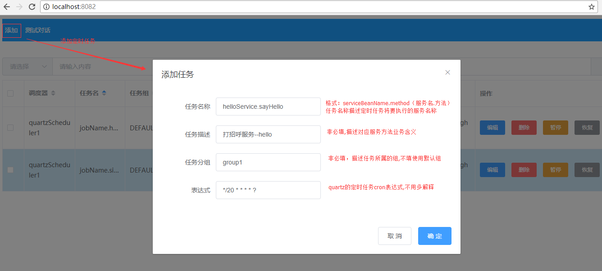
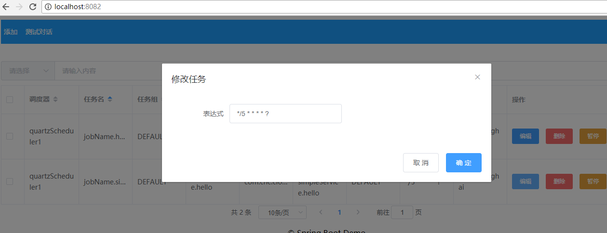

# 基于quartz集群分布式动态定时任务管理 

> 真正动态，定时任务“0”开发，基于quartz集群超轻量级扩展实现。

- 不多说，先看效果

- 添加定时任务

- 编辑定时任务-修改定时规则

### 特点：
1. 基于quartz集群,轻量扩展。可快速改造现有项目
2. 完全动态管理,可自定义任何XxxService.xxx()服务方法为定时任务,简化定时任务开发配置过程

### 实现功能：
1. 整体性:定时任务集群,同一任务同一时间只有一个实例在执行
2. 可用性:集群可用情况下,单个实例的存活,不影响整体定时任务的执行(quartz集群本身功能)
3. 灵活性:任意节点，访问管理界面，动态管理定时任务(动态创建修改删除定时任务)

### 技术选型
- quartz.version 2.2.1
- spring.version 4.2.6.RELEASE
- mybatis.version 3.3.0
- pagehelper.version 5.0.0

### 当前demo版本 1.1.0 添加功能:
1. 定时任务添加服务校验,必须存在服务及对应方法
2. 事务支持 不符合校验无法添加任务

### 后续版本规划增加功能
1. 自动记录定时任务执行的日志,方便运维
2. 注解形式描述系统所有可用作为定时任务的服务方法,操作界面下拉可选

### 快速启动
1. 在quartz连接的数据库执行sql文件的 分布式定时任务初始化建表.sql的内容。
2. 访问http://localhost:8082/ (端口号自己定义)
3. 接口文档访问地址:http://localhost:8082/swagger-ui.html
4. 添加服务方法及定时周期 测试，启/停/修改定时任务(也可以添加任意自己开发服务，动态生成定时任务)
- helloService.sayHello    */5 * * * * ?
- simpleService.testMethod1   */15 * * * * ?
- simpleService.testMethod2   */35 * * * * ?
### 实现原理(画重点)
- 参考博客:https://blog.csdn.net/Myron_007/article/details/79856097
- 项目地址:https://github.com/MusicXi/demo-quartz.git 

### 交流联系
项目详细设计说明:https://blog.csdn.net/Myron_007/article/details/79856097 有疑问请留言,如果博客回复不及时，或不好描述。
加临时群,439019717,把问题说明截图,。解决完可以自行退出。

### 参考技术资料：
1. Quartz在Spring中集群  http://sundoctor.iteye.com/blog/486055?page=2
2. Spring Boot集成持久化Quartz定时任务管理和界面展示 http://blog.csdn.net/u012907049/article/details/73801122
3. Spring+SpringMVC+mybatis+Quartz整合  http://blog.csdn.net/u012907049/article/details/70273080
4. Vue.js 学习地址:https://cn.vuejs.org/v2/guide/
5. vue-element-admin   https://github.com/PanJiaChen/vue-element-admin/blob/master/README.zh-CN.md

6. Quartz集群原理及配置应用，实例使用 https://blog.csdn.net/zhen340417593/article/details/53436819
7. Quartz任务调度的基本实现原理 https://www.cnblogs.com/zhenyuyaodidiao/p/4755649.html
8. 《Quartz学习——Quartz大致介绍（一）》 https://blog.csdn.net/u010648555/article/details/54863144